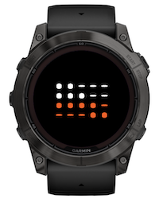

# Garmin Morse Time

A minimalist, elegant, typography-focused Garmin Connect IQ watch face that displays the current time with Morse digits.




## Contents

* [Morse digits](#morse-digits)
* [Project structure](#project-structure)
* [Build, test, deploy](#build-test-deploy)

## Morse digits

The [Morse code](https://en.wikipedia.org/wiki/Morse_code) represents the digits 0-9 with five dot or dash symbols each.
The table below shows the complete encoding.

| Decimal digit | Morse code |
| ------------: | :--------- |
| 0             | `-----`    |
| 1             | `.----`    |
| 2             | `..---`    |
| 3             | `...--`    |
| 4             | `....-`    |
| 5             | `.....`    |
| 6             | `-....`    |
| 7             | `--...`    |
| 8             | `---..`    |
| 9             | `----.`    |

The Garmin Morse Time watch face uses custom fonts:
* [SyneMono](https://fonts.google.com/specimen/Syne+Mono) (for Morse time) 
* [Ubuntu](https://fonts.google.com/specimen/Ubuntu) (for standard time).

The fonts are available from [Google Fonts](https://fonts.google.com/) in True Type font (`ttf`) format.
They have been converted to bitmap fonts (`bmp` and `fnt`) using the open source command-line [`ttf2bmp`](https://github.com/wkusnierczyk/ttf2bmp) converter.


## Project structure

```bash
MorseTime
├── LICENSE                        # MIT license
├── Makefile                       # Convenience makefile
├── manifest.xml
├── monkey.jungle
├── README.md                      # This file
├── resources
│   ├── drawables
│   │   ├── drawables.xml
│   │   └── launcher_icon.png
│   ├── fonts
│   │   ├── fonts.xml              # App font specification 
│   │   ├── OFL.txt                # Open Font License
│   │   ├── UFL.txt                # Use Font License
│   │   └── [ttf, fnt, png fonts]  # Source (ttf) and converted (fnt, png) fonts
│   ├── graphics                   # Font face screenshots
│   │   ├── morse-standard.png
│   │   └── morse.png
│   ├── layouts
│   │   └── layout.xml             # App layout specification
│   └── strings
│   │   └── strings.xml
│   ├── settings                   # App settings
│   │   ├── properties.xml
│   │   └── settings.xml
└── source
    ├── MorseTime.mc
    ├── MorseTimeApp.mc
    ├── MorseTimeSettings.mc
    ├── MorseTimeView.mc
    └── StringUtils.mc
```

## Build, test, deploy

To modify and build the sources, you need to have installed:

* [Visual Studio Code](https://code.visualstudio.com/) with [Monkey C extension](https://developer.garmin.com/connect-iq/reference-guides/visual-studio-code-extension/).
* [Garmin Connect IQ SDK](https://developer.garmin.com/connect-iq/sdk/).

Consult [Monkey C Visual Studio Code Extension](https://developer.garmin.com/connect-iq/reference-guides/visual-studio-code-extension/) for how to execute commands such as `build` and `test` to the Monkey C runtime.

You can use the included `Makefile` to conveniently trigger some of the actions from the command line.

```bash
# build binaries from sources
make build

# run unit tests
make test

# run the simulation
make run
```

**Note**  
To successfully execute the `test` and `run` targets, you need to start the simulator first.
Consult [developer.garmin.com/connect-iq/connect-iq-basics/your-first-app](https://developer.garmin.com/connect-iq/connect-iq-basics/your-first-app/) for details.
The site also explains how to sideload an application to a Garmin watch.
